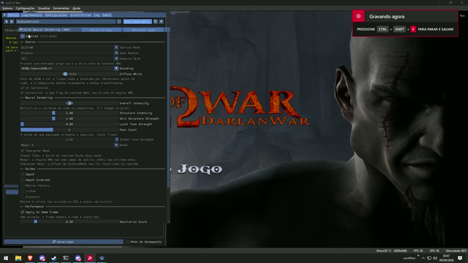
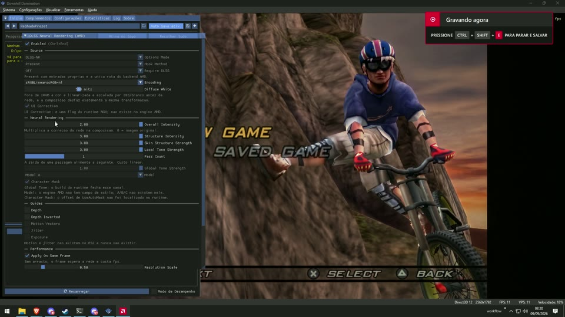

# dlss5-neural-amd

ReShade add-on that runs the DLSS-NR network on AMD cards.

*Em português: [LEIA-ME.md](LEIA-ME.md).*

Every tool I found for DLSS 5 (renodx-dlss, DLSS5-Feeder, DLSS5-Swapper) calls NVIDIA's
`nvngx_dlssnr.dll`, so none of them do anything on a Radeon. This one drives the AMD port of
the network instead, from a ReShade add-on, same idea as RenoDX: one core file plus a small
table where you add a game.

**PCSX2 is the only thing I've ever run this on.** Not a native D3D12 game, not RPCS3, not
another card, not RDNA3. I genuinely don't know how it behaves anywhere else, and the other
rows in the target table are guesses I typed, not results.

That said the plumbing isn't pcsx2-specific. It's a ReShade add-on talking to a D3D12 device,
so anything ReShade attaches to and that renders in D3D12 is at least in scope. Adding a target
is one row in a table. If you want to point it at something else, most of the work is already
sitting here, and figuring out what a new target actually exposes is what the probe in
`src/probe` is for.

Discord: https://discord.gg/wYhvS3JSHM
That server is for DLSS 5 in general, AMD, ports, whatever people are building. It isn't a
support channel for this add-on.

**Just want it running?** → [Before you start](#before-you-start) → [Quick start](#quick-start).
Six steps, no compiler needed.
**Something's broken?** → [Troubleshooting](#troubleshooting), which is keyed by what you see on
screen.
**Want to change the code?** → [Building it yourself](#building-it-yourself-optional).

## Videos

PCSX2, no audio. Click to play.

[](https://github.com/zmodelerlover/dlss5-neural-amd/raw/master/media/pcsx2-0307.mp4)

[](https://github.com/zmodelerlover/dlss5-neural-amd/raw/master/media/pcsx2-0320.mp4)

---

## Before you start

| | |
|---|---|
| **GPU** | AMD **RDNA3 or RDNA4** with the **HIP 7** runtime, i.e. `amdhip64_7.dll` on the search path. HIP 6 will not do. A current Adrenalin driver ships it. This does nothing on NVIDIA or Intel. |
| **Renderer** | The game has to be on **Direct3D 12**. On D3D11, Vulkan or OpenGL the add-on loads and then sits there. |
| **ReShade** | The **add-on** build, 6.x. The plain one will not load add-ons. Tested on 6.8.0. |
| **Disk** | About 150 MB for the network weights. |

Tested on: RX 9070 XT, ReShade 6.8.0, **PCSX2 2.3.14 and 2.8.2**, God of War 1. Nothing else has
been tried by me.

**Where do the files go? Always next to `pcsx2-qt.exe`.** That is true whether your PCSX2 is a
portable copy on an external drive or a normal install — the add-on only ever looks in the
folder the running `.exe` is in. The portable-vs-installer difference only matters for PCSX2's
own *settings*, which comes up once in [step 5](#5-set-pcsx2-to-direct3d-12).

---

# Quick start

Three files end up next to `pcsx2-qt.exe`: one from the release, two from the discord. A fourth
writes itself. That's the whole install.

### 1. Get the add-on

Download `dlss5-neural.addon64` from
**[Releases](https://github.com/zmodelerlover/dlss5-neural-amd/releases/latest)**.

That's it. **You do not need to build anything** — the file in the release is compiled from this
exact repository. Building is only if you want to change something, and it has
[its own section](#building-it-yourself-optional) at the bottom.

### 2. Get the runtime and the weights

`dlssnr_amd_pass1.dll` (7 MB) and `dlssnr_on_amd_weights.bin` (141 MB) are **not in this repo
and never will be.** The weights are NVIDIA-derived and the runtime comes from a third-party
project that declares no license, so I'm not the one redistributing them.

> **Both are in the `files` channel on the discord → https://discord.gg/wYhvS3JSHM**

The `.dll` there is already rebuilt without the spin cap, so it goes straight in the folder with
no patching. Check what you downloaded against `tools/SHA256SUMS.txt`:

```powershell
Get-FileHash dlssnr_amd_pass1.dll, dlssnr_on_amd_weights.bin -Algorithm SHA256
```

It has to be exactly that build. The add-on hashes it at load and refuses anything else, because
the whole thing is hardcoded offsets into one specific binary and pointing them at a different
one hangs the game.

### 3. Install ReShade into PCSX2

Get the **add-on** build of ReShade (the one labelled "with full add-on support") from
<https://reshade.me/>, run it, pick `pcsx2-qt.exe`, choose **Direct3D 10/11/12**. Skip the
shader download, this doesn't use any.

### 4. Copy the files in

Next to `pcsx2-qt.exe`:

```
dlss5-neural.addon64
dlssnr_amd_pass1.dll
dlssnr_on_amd_weights.bin
```

`dlssnr_on_amd.ini` shows up on its own the first time it runs. Don't delete it — see
[the engine ini](#the-engine-ini) below.

### 5. Set PCSX2 to Direct3D 12

Settings → Graphics → Renderer → **Direct3D 12**. On anything else the add-on loads and then
sits there doing nothing.

**Watch out for per-game overrides.** A renderer pinned on one game beats your global setting
silently, and that wasted an entire evening for me. Easiest way to check, no matter where PCSX2
lives: **right-click the game in the list → Properties → Graphics**, and make sure Renderer is
either *Direct3D 12* or left on the global setting.

If you'd rather look at the file, it's `gamesettings\<SERIAL>.ini` — but *which folder* that is
depends on how PCSX2 was installed:

* **Portable** — you extracted the `.7z`/`.zip`, or there's a `portable.ini` next to the exe.
  Common if PCSX2 lives on an external drive. Everything sits next to `pcsx2-qt.exe`:
  `gamesettings\`, `inis\`, `memcards\`, `cache\`. There is no `Documents\PCSX2` at all.
* **Installer** — `Documents\PCSX2\gamesettings\`.

**You want `Renderer = 15`.** 15 is Direct3D 12, which is the only thing this add-on works on.
`Renderer = 3` is Direct3D 11 — if you find that line, it is the problem, not the fix. Deleting
the line entirely is also fine: it just falls back to your global setting.

### 6. Start a game

Hit **Home** for the ReShade overlay → **Add-ons** tab → **DLSS Neural Rendering (AMD)**.
The status line says whether it's actually running. There's also `dlss5-neural.log` next to
the exe.

The defaults are the settings I got the numbers below with — Encoding sRGB, Resolution Scale
0.50, Pass Count 1, inline on — so there is nothing you have to change. Nothing is saved
between runs either; every launch starts from those defaults.

---

## Troubleshooting

| What you see | What it is |
|---|---|
| Add-on isn't in the Add-ons tab at all | `ReShade.ini` has `DisabledAddons=dlss5 neural@dlss5-neural.addon64` under `[ADDON]`. ReShade writes that line if you ever untick the add-on, and then it never loads again, with no error anywhere. Clear it. |
| Status says the API is wrong | PCSX2 isn't on D3D12. Check the per-game override too, not just the global setting: right-click the game in the list, Properties, Graphics. |
| `HIP: amdhip64_7.dll failed to load` | HIP 7 isn't installed. HIP 6 doesn't count. |
| `hash mismatch; refused` | Wrong `dlssnr_amd_pass1.dll`. Compare against `tools/SHA256SUMS.txt`. The refusal is deliberate — the alternative is a hang. |
| Game dies with `887A0005` / device removed | `DXGI_ERROR_DEVICE_REMOVED`, from a Windows TDR. See [the engine ini](#the-engine-ini). |
| It runs but "only shifts the colours a bit" | Encoding is wrong. On an 8-bit SDR back buffer it has to be **sRGB**. scRGB-nl linearises something that is already sRGB and then scales it by 203/white, so the network gets a nearly black image and does nothing. Ask me how I know. |
| `imgui.h` or `reshade.hpp` not found when building | You deleted `external/`. It's in the repo now; `git checkout external` puts it back. |

### If you're reporting a problem

Screenshots don't help much here — flicker is frames alternating, and a still image freezes one
of them, so it always looks fine. Two things settle almost anything:

1. **The status line.** ReShade overlay → Add-ons → DLSS Neural Rendering (AMD). It reads
   `Running: X processed, Y skipped (Z%)` plus the back buffer and network size. Quote that line.
2. **The logs**, both next to `pcsx2-qt.exe` — the same folder you put the add-on in, portable
   install or not:
   * `dlss5-neural.log` — the add-on: what it detected, back buffer size and format, and the
     residual measurement it takes on frame 240.
   * `dlssnr_on_amd.log` — the runtime: staging formats, per-job timings, timeouts, faults.

The residual measurement in the first one is the useful bit. `mean 0.000000` means the network
returned its input untouched, which is a completely different problem from a nonzero residual
that looks wrong on screen. They are indistinguishable from the couch.

### The engine ini

The runtime reads `dlssnr_on_amd.ini` from the game folder when it loads. **Its own built-in
default for the host watchdog is 600 ms**, and one stalled job that long trips Windows TDR,
which removes the D3D12 device and takes the emulator with it. The symptom is a pile of
`887A0005` in `emulog.txt` and a dead PCSX2, with nothing pointing back at this add-on.

So the add-on writes the file itself if it isn't there, with `InlineWaitMs=100`. At 0.50 scale
the network takes about 16 ms, so 100 is a wide margin, and past it you get a frame without the
effect instead of a freeze. Delete the file and it gets written again; edit it and your version
is kept. Don't raise `InlineWaitMs` far without knowing why.

## Building it yourself (optional)

**Skip this unless you want to change the code.** The `.addon64` in
[Releases](https://github.com/zmodelerlover/dlss5-neural-amd/releases/latest) is built from this
repository and is the same file you would produce here.

**What to install first.** One thing: Microsoft's C++ compiler. You do not need the full Visual
Studio IDE — **Build Tools for Visual Studio** is free and enough. Get it from
<https://visualstudio.microsoft.com/downloads/>, under *Tools for Visual Studio* → *Build Tools
for Visual Studio*. In its installer tick the single workload **"Desktop development with C++"**
and install. That workload brings the Windows SDK with it, which is the other half of what the
build needs. If you already have Visual Studio with C++, you already have all of this.

**Then, in PowerShell:**

```powershell
git clone https://github.com/zmodelerlover/dlss5-neural-amd
cd dlss5-neural-amd
powershell -ExecutionPolicy Bypass -File .\build.ps1 -Target neural
```

Note the `-ExecutionPolicy Bypass`. Windows refuses to run downloaded `.ps1` files by default, so
plain `.\build.ps1` usually fails with *"cannot be loaded because running scripts is disabled on
this system"*. That message is Windows, not this project. The line above sidesteps it for that
one command without changing anything on your machine.

**That is the whole build.** Nothing to download first, no submodules, no `vcpkg`, no CMake, no
`.sln` to open. The ReShade and ImGui headers are already in `external/reshade/` — see
[external/reshade/NOTICE.md](external/reshade/NOTICE.md) for what they are and where they came
from. `build.ps1` finds the compiler and the SDK by itself; if it picks the wrong one, pass
`-VsPath` or `-SdkPath`.

**It worked if** the last two lines look like this, and `build\dlss5-neural.addon64` exists:

```
OK: ...\build\dlss5-neural.addon64
dlss5-neural.addon64  73728  ...
```

**If it fails:**

| Message | Fix |
|---|---|
| `cannot be loaded because running scripts is disabled` | You dropped the `powershell -ExecutionPolicy Bypass -File` part. |
| `vswhere.exe not found` / `No Visual Studio install with the C++ tools` | The C++ workload isn't installed. Re-run the Build Tools installer and tick *Desktop development with C++*. |
| `Windows 10/11 SDK not found in the registry` | Same installer, same workload — it includes the SDK. Or pass `-SdkPath`. |
| `fatal error C1083: 'imgui.h'` | You deleted `external/`. `git checkout external` puts it back. |
| `git` is not recognised | Install Git for Windows, or just use the release build instead. |

The other two targets build the same way: `-Target probe` (dumps what a game exposes) and
`-Target session`. CI on `windows-latest` builds all three from a bare checkout on every push,
so if the badge is green the repository builds as-is.

## Rebuilding the runtime yourself

You don't need this — the DLL on the discord is already the rebuilt one. It's here for anyone
who wants to see what was changed rather than take my word for it.

`tools/runtime-patches.json` is the spec: five patches, with offsets, the bytes before, the
bytes after, and why. Grab the untouched `version.dll` from the discord and:

```powershell
python tools\patch_runtime.py version.dll tools\runtime-patches.json dlssnr_amd_pass1.dll
```

That applies four of the five and **skips the fifth on purpose.** The fifth is the one the
OptiScaler installer uses to cap the GPU wait shader at 262144 iterations, about 6 ms. The
network takes 16 ms at half scale and 125-187 ms at full, so inline mode timed out on every
single frame, and the apply pass just kept its input. Residual came out at exactly zero, which
is a fun way to spend a few hours.

Everything is written in place at the same length, so no RVA moves and the add-on's offsets stay
valid. The script prints a new SHA256; paste it into `kRuntimeSha256` in `src/neural/neural.cpp`
and rebuild.

## What it does per frame

```
back buffer -> colour prep -> network raster -> network -> residual -> compose -> back buffer
```

Only the network's correction gets resampled, the full-res image goes back untouched. It hooks
`present`, because `reshade_finish_effects` never fires if you have no shaders loaded.

## Numbers

PCSX2 2.8.2, God of War, 1920x1080 back buffer, scale 0.50, 1 pass, RX 9070 XT:

```
network input, mean absolute   0.0207
residual, mean                 0.0115
residual, max                  0.792
per job                        15-16 ms
frames with a fresh correction 3932 of 3960
```

The add-on measures that itself on one frame and dumps it in the log. Worth keeping, because
"the network isn't doing anything" and "the network works and my compose is eating it" look
identical from the couch and need completely different fixes.

## Repository layout

| | |
|---|---|
| `src/neural/neural.cpp` | the add-on. One file. |
| `src/probe/probe.cpp` | render target probe — dumps what a game actually exposes. Build with `-Target probe`. |
| `src/session/session.cpp` | small session logger. |
| `external/reshade/` | ReShade + ImGui headers, vendored. See `NOTICE.md`. |
| `tools/patch_runtime.py` | rebuilds the runtime from `version.dll`. |
| `tools/runtime-patches.json` | the five patches, with offsets and bytes. |
| `tools/SHA256SUMS.txt` | hashes of the four files the repo does not ship. |
| `build.ps1` | builds an add-on with `cl.exe`, no VS project. |

## Stuff I didn't get to

None of this is settled, it's just where I stopped. One card, one program, one night.

* Upscaling. I couldn't find an upscaling path in the AMD runtime I used, input and output
  share the same texture. Maybe another build has one.
* Model/style, UI correction, character mask. The NVIDIA add-on exposes these. I didn't find
  the fields on the AMD side, which might mean they're not there or might mean I missed them.
* Depth. PCSX2 writes a real 512x512 R32G8X24_TYPELESS buffer, the probe in this repo finds it.
  ReShade's `bind_render_targets_and_depth_stencil` never reached my add-on on D3D12 though, so
  it's not hooked up. Code's written, sitting behind the Depth switch. If you get it working
  you're feeding one more guide than the NVIDIA path does here.
* Motion. Nothing showed up. Those games didn't compute per-pixel motion, but optical flow or
  digging into the emulator's own buffers are both unexplored.
* The network itself. DLSS-NR is a denoiser for modern ray traced stuff. Something built for
  restoration or upscaling old content would probably fit emulators better, and swapping it
  doesn't mean rewriting everything.
* Literally anything that isn't PCSX2. A D3D12 game with a real upscaler would hand the network
  colour, depth and motion, which is what it was built for. That's where it should look like
  the videos everyone's seen. Nobody's tried it with this.

## License

MIT, in `LICENSE`. Third-party headers under `external/` keep their own licenses, listed in
`external/reshade/NOTICE.md` — BSD-3-Clause OR MIT for ReShade, MIT for Dear ImGui. No network
binaries in here and it doesn't download any.
