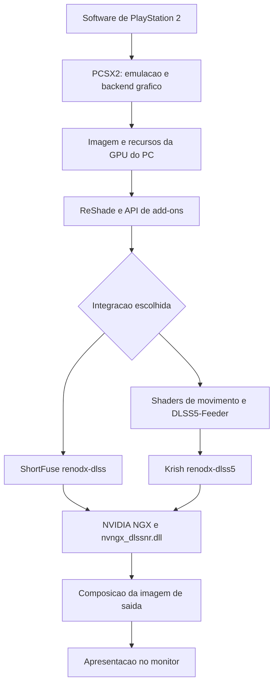
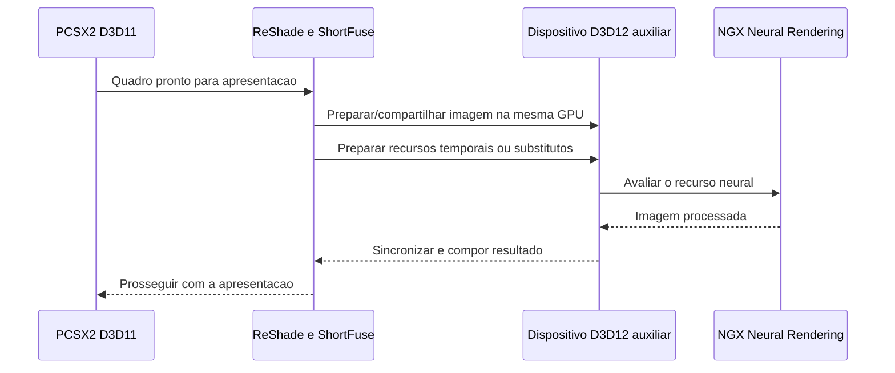
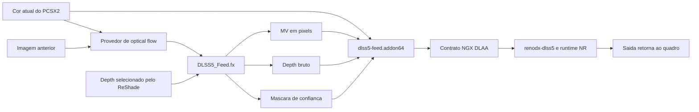

# RenoDX, ReShade e Neural Rendering no PCSX2

## 1. Identificação da versão e escopo

A integração mais direta para o PCSX2 de 64 bits é o **DLSS Tool de ShortFuse**, cujo arquivo é `renodx-dlss.addon64`. Ele permite executar o Neural Rendering sobre a imagem apresentada pelo emulador. Existe também outro caminho: **DLSS5-Feeder + `renodx-dlss5.addon64`**, o add-on de Krish. Os nomes diferem por um único número, mas representam arquiteturas diferentes. O código do instalador RHI trata os dois add-ons como alternativas mutuamente exclusivas.[^1][^2]

O processamento neural propriamente dito fica no runtime NVIDIA `nvngx_dlssnr.dll`. RenoDX integra esse runtime à aplicação; ReShade fornece a infraestrutura de interceptação e de efeitos. Portanto, instalar apenas um preset `.ini`, um shader `.fx` ou um mod HDR genérico de RenoDX não equivale a instalar Neural Rendering.[^2][^3][^4]

Este documento descreve o estado consultado em **9 de setembro de 2026**, com foco em Windows e PCSX2 x64. O pacote ShortFuse examinado foi o **SF 0.54**, publicado pelo distribuidor RHI em 8 de setembro. Também foram consultados o código público do PCSX2, do Feeder e do LumeniteFX. Os detalhes de identificação e as fontes estão nas seções finais.

Há três níveis de evidência ao longo do texto:

- **Código/documentação:** comportamento descrito por fontes do projeto ou diretamente identificável no código público.
- **Binário:** nomes, parâmetros e explicações incorporados ao ShortFuse 0.54, examinados estaticamente. Isso confirma o que o programa declara, sem provar seu resultado visual.
- **Análise:** consequências arquiteturais deduzidas dessas interfaces; quando relevante, são identificadas como inferências.

Não houve execução do PCSX2 com esses add-ons para este relatório. O funcionamento em PS2 tem relatos públicos específicos, mas não significa compatibilidade comprovada com todos os jogos, renderizadores, drivers ou placas.

## 2. Respostas sobre cor, profundidade, movimento e outros recursos

| Recurso | O que existe | Particularidade no PCSX2 |
|---|---|---|
| Alteração neural da aparência | Processamento da imagem com controles de intensidade e modelo | Pode modificar a aparência de materiais, rostos e iluminação percebida; não altera os assets do jogo |
| Cor tradicional | ReShade aceita efeitos de cor; PCSX2 possui Shade Boost | Brilho, contraste, saturação e gamma podem ser ajustados independentemente do NR |
| Tonalidade neural | ShortFuse expõe intensidade de tom local e global | O próprio SF 0.54 avisa que o efeito do controle global não é visível no caminho NGX recuperado |
| Profundidade real da cena renderizada | Pode ser capturada pelo ReShade a partir de um buffer gráfico do PCSX2 | Depende de jogo, backend, seleção do buffer e alinhamento com a imagem |
| Profundidade no ShortFuse em Present | O caminho sem DLSS admite entradas temporais substitutas | Estar ativo não comprova que a profundidade do PS2 esteja sendo utilizada |
| Vetores reais de movimento do jogo | A integração nativa com motores modernos pode recebê-los | O GS do PS2 não oferece ao add-on um buffer moderno de velocidades por objeto |
| Movimento estimado | Feeder aceita optical flow de shaders como LumeniteFX | O movimento é inferido comparando imagens, com erros possíveis em transparências, HUD e mudanças de luz |
| Normais | LumeniteFX pode reconstruir normais em espaço de tela | O contrato principal do Feeder examinado não as envia como entrada explícita ao DLSS |
| Máscara de personagens | ShortFuse possui detecção/máscara automática e controle de estrutura da pele | Não equivale a receber IDs ou máscaras exatas do jogo de PS2 |
| Proteção de interface | Existe UI Correction | A interface já pode estar misturada à cena; correção automática não garante preservação perfeita |
| Escala de processamento | ShortFuse permite mudar a resolução do trabalho neural; Feeder tem controle próprio | Não confundir com a resolução interna de renderização do PCSX2 |
| Várias passagens neurais | SF 0.54 declara de 1 a 10 passagens sequenciais | Aumentam custo e podem intensificar alterações visuais |
| Motion blur | Pode ser um efeito adicional do ReShade | Motion vectors não são motion blur; NR não implica desfoque de movimento |
| Frame generation | É outro recurso da família DLSS, com integração própria | Ativar NR não cria automaticamente quadros extras nem aumenta a velocidade da emulação |
| Ray tracing/path tracing | Não é acrescentado ao motor do jogo por esse caminho genérico | Aparência de iluminação mais realista não comprova simulação de raios sobre a geometria |
| HDR | RenoDX possui infraestrutura HDR e os add-ons precisam respeitar a codificação de cor | NR, HDR e conversão de SDR para HDR são operações distintas |

A tabela sintetiza as interfaces do ShortFuse, os shaders do Feeder/LumeniteFX, o Shade Boost do PCSX2 e a documentação do ReShade.[^3][^4][^5][^6][^7]

## 3. Camadas da arquitetura

### 3.1 PCSX2: emulação e renderização

PCSX2 executa o software de PS2 e reproduz o comportamento de seu sistema gráfico. O backend de hardware traduz o trabalho do Graphics Synthesizer, ou GS, para operações da GPU do computador. O resultado são texturas, render targets, operações de composição e uma imagem que será apresentada na janela.[^8][^9]

### 3.2 ReShade: interceptação e efeitos

ReShade se conecta à API gráfica usada pelo processo. No caminho Direct3D, uma instalação comum utiliza uma DLL proxy como `dxgi.dll`. O runtime mantém a interface de configuração, compila efeitos ReShade FX e permite que add-ons acompanhem eventos gráficos. A edição com suporte a add-ons é necessária para carregar os componentes nativos aqui descritos.[^4]

Um `.fx` é um programa de efeito, com técnicas, passagens e texturas. Um `.addon64` é código nativo carregado no processo, com acesso à API de add-ons e capacidade de fazer operações que não cabem em um simples shader de pós-processamento. Um `.ini` armazena configurações; não contém o modelo neural.

### 3.3 RenoDX e o add-on DLSS

O framework RenoDX oferece substituição de shaders, injeção de buffers, atualização de recursos e swapchains, overlays e persistência de configurações. Essas são capacidades do framework; cada mod escolhe quais utilizar.[^3]

No ShortFuse DLSS, o trabalho específico é localizar o ponto de entrada, preparar uma imagem e os recursos necessários, configurar o runtime neural, executar o processamento e integrar a saída à apresentação. No caminho Krish + Feeder, o Feeder cria o contexto de processamento que o add-on neural espera encontrar.

### 3.4 NVIDIA NGX e o runtime NR

NGX é a camada de serviços pela qual essas integrações criam e avaliam recursos DLSS. `nvngx_dlssnr.dll` contém a implementação neural proprietária utilizada pelo mod. `nvngx_dlss.dll` corresponde à super-resolução/DLAA; `nvngx_dlssd.dll` e `nvngx_dlssg.dll` têm funções diferentes, associadas a Ray Reconstruction e Frame Generation.[^1][^2]

Ter todas essas DLLs instaladas não significa que o PCSX2 esteja utilizando todas as tecnologias. O RHI pode distribuir uma pilha ampla para atender a diversos jogos; a execução depende de qual funcionalidade efetivamente recebe entradas válidas.



## 4. Arquitetura do modelo neural: o que é público

A descrição técnica pública da NVIDIA apresenta o DLSS 5 como uma etapa generativa de aparência. Ela informa o uso de **difusão em espaço de pixels com uma etapa**, condicionada pela imagem renderizada, vetores de movimento, estado temporal e parâmetros de direção artística. A inferência é causal e determinística para entradas e estados equivalentes; o treinamento inclui supervisão de consistência derivada do renderizador.[^10]

Uma representação conceitual é:

```text
(imagem processada, estado seguinte) =
    modelo(imagem atual, movimento, estado anterior, controles artísticos)
```

A equação descreve a relação entre entradas e saídas. Não é uma assinatura de API, nem revela a organização exata dos tensores do runtime.

A publicação distingue esse estágio da reconstrução convencional: o sistema acrescenta aparência aprendida, e não apenas tenta reproduzir uma renderização tradicional mais cara. Entretanto, isso descreve a tecnologia da NVIDIA. Não comprova que uma integração genérica no PCSX2 forneça a mesma qualidade de condicionamento de um jogo integrado oficialmente.[^10][^11]

Não há, nas fontes examinadas, especificação suficiente para reproduzir toda a rede: quantidade e dimensões das camadas, número de parâmetros, todos os pesos, kernels internos e correspondência completa entre modelos A/B/C permanecem fora do que este relatório pode confirmar. O código do Feeder e do PCSX2 é público; isso não torna público o interior de `nvngx_dlssnr.dll`.

Também não se deve interpretar “3D-guided” como acesso automático à cena completa. No PCSX2, o ponto de captura genérico vê a representação que chega à API gráfica do computador. Relações semânticas do jogo, materiais originais, esqueletos, luzes e objetos não aparecem magicamente como entradas estruturadas do modelo.

## 5. O que o emulador de PS2 realmente disponibiliza

### 5.1 Dados do GS não equivalem ao G-buffer de um motor moderno

No código examinado, `GSVertex` contém coordenadas de textura, RGBA/Q, XYZ, UV e fog. Essa estrutura não contém identificador persistente de personagem, transformações anteriores de objetos, velocidade em tela, roughness ou material PBR.[^12]

Isso não significa que o jogo desconheça seus personagens ou suas matrizes. Significa que tais informações não constituem um contrato universal exposto ao add-on no ponto em que o PCSX2 renderiza o GS. Um jogo pode ter feito transformações e cálculos antes de enviar os comandos gráficos.

**Consequência arquitetural:** reconstruir vetores exatos de animação exigiria trabalho adicional, possivelmente específico por jogo. Comparar pixels é uma solução genérica; acompanhar a identidade e a transformação de todos os objetos é um problema diferente.

### 5.2 A imagem final já passou por composição

`GSRenderer::Merge` combina saídas gráficas e pode aplicar desentrelaçamento, Shade Boost e FXAA. O código também cuida de proporção, recortes e apresentação. Na etapa de apresentação, o PCSX2 desenha componentes de sua própria interface/OSD.[^8]

Assim, um hook no final pode receber:

- Cena de PS2 já composta com HUD, legendas e transparências.
- Imagem desentrelaçada, redimensionada ou recortada.
- Barras laterais ou superiores, dependendo da apresentação.
- Efeitos de cor anteriores e elementos desenhados pelo emulador.

O conjunto exato depende da ordem real dos hooks. Não é seguro presumir que a imagem capturada seja uma cena limpa, sem interface.

### 5.3 Profundidade é possível, mas não é universal

O backend D3D12 possui recursos de depth/stencil e formatos de leitura associados; o shader do GS implementa testes e escritas de profundidade. Portanto, existe profundidade no renderizador. A dificuldade está em selecionar o recurso certo e associá-lo à imagem apresentada.[^9][^13]

Um jogo pode alternar render targets, reaproveitar buffers ou desenhar elementos que não escrevem profundidade. Um buffer válido em uma cena pode ficar inadequado em menus, vídeos, efeitos especiais ou outra câmera. Em cenários com resolução interna maior que a janela, a textura de profundidade também pode ter dimensões diferentes das do backbuffer.

## 6. Caminho A: ShortFuse direto, adequado ao PCSX2 x64

### 6.1 Ponto de entrada

O binário SF 0.54 identifica um modo `Present` compatível com apresentações D3D9, D3D11 e D3D12. Em D3D9/D3D11, ele declara utilizar um dispositivo D3D12 auxiliar na **mesma GPU**. Não se trata de uma segunda placa de vídeo nem de outro emulador.[^5]

Em jogos modernos, o add-on pode aproveitar saídas e entradas temporais de DLSS existentes. No PCSX2 convencional, essa origem não existe. O modo relevante é o processamento do backbuffer de apresentação, permitindo entradas temporais substitutas quando não há dados compatíveis.



O diagrama representa a arquitetura declarada pelo binário e corroborada por logs públicos. Não pretende descrever todas as funções internas ou garantir a quantidade exata de cópias em cada versão.[^5][^14]

### 6.2 Require DLSS e o uso de dados substitutos

O SF 0.54 explica que, em `Present`, utiliza recursos de Frame Generation quando disponíveis e, caso contrário, recursos de upscaling disponíveis. Sem nenhum deles, `Require DLSS` ligado impede o processamento; desligado admite temporais substitutos.[^5]

Para o PCSX2 sem integração DLSS nativa, essa distinção é central. Um status ativo pode indicar processamento neural sobre cor, mas não demonstra a presença de vetores corretos, profundidade útil ou histórico semanticamente alinhado.

A expressão “dummy temporals” descreve recursos substitutos. Sem o código completo dessa implementação, não é correto inventar seus valores exatos, a política integral de reset ou afirmar que o algoritmo passou a ser estritamente independente de histórico.

### 6.3 Preparação e composição de cor

O add-on declara reconhecer diferentes codificações de origem. Em automático, diferencia uma saída nativa DLSS, tratada como linear BT.709, de origens posteriores, nas quais consulta o espaço de cor da swapchain. Seus textos também informam que a imagem preparada entregue ao NR é sRGB.[^5]

Isso implica uma arquitetura com adaptação de cor:

```text
origem e sua codificação
    → preparação para o domínio esperado pelo NR
    → execução neural
    → reconstrução/composição da correção
    → retorno à convenção da saída
```

Trocar a interpretação de sRGB por linear sem correspondência com o recurso muda a luminância recebida pelo modelo. Uma imagem lavada ou escura pode ter origem nessa interpretação, e não no controle de intensidade.

### 6.4 Escala de resolução e reconstrução residual

O SF 0.54 tem controles de escala, domínio de filtragem, redução, ampliação e reconstrução. Na opção residual, a descrição incorporada informa que a correção RGB do NR é ampliada e aplicada à imagem preparada em resolução completa. Na outra opção, a própria imagem processada é ampliada.[^5]

Uma formulação ilustrativa da reconstrução residual é:

```text
imagem_reduzida = reduzir(imagem_preparada)
resultado_reduzido = NR(imagem_reduzida)
correcao_reduzida = resultado_reduzido - imagem_reduzida
resultado_final = imagem_preparada + ampliar(correcao_reduzida)
```

Essa equação explica a ideia; os filtros, domínios e cálculos exatos dependem da implementação. Sua vantagem potencial é preservar detalhes finos da imagem original enquanto a modificação neural é calculada em menor resolução. É uma inferência, não um benchmark visual.

## 7. Controles do ShortFuse 0.54

Os controles abaixo foram identificados nos textos incorporados ao binário dessa versão. A existência do controle e sua descrição não garantem efeito visual em todas as combinações de runtime, modelo e origem. Os nomes podem diferir dos utilizados por tutoriais anteriores.[^5]

| Controle | Função declarada ou interpretação delimitada | Observação no PCSX2 |
|---|---|---|
| Options Mode | Seleciona a família de opções: NR, FG ou SR/DLAA | Selecionar a área NR não integra as outras tecnologias ao emulador |
| Hook Method | Escolhe a origem/etapa, incluindo Upscaled e Present | Present é o caminho genérico relevante sem DLSS nativo |
| Require DLSS | Exige dados de uma integração DLSS reconhecida | Desligado permite o caminho com temporais substitutos |
| Encoding | Interpretação do espaço de cor de origem | Auto depende das informações disponíveis; forçar incorretamente pode distorcer cor |
| UI Correction | Solicita correção de interface ao runtime | Auto é habilitado para origem swapchain e desabilitado para origens nativas/HUD-less |
| Diffuse White | Referência de branco usada na adaptação de cor | Não altera sozinho o brilho físico máximo do monitor |
| Overall Intensity | Envia `DLSSNR.Intensity` | Slider normalizado de 0 a 1; entradas manuais são encaminhadas sem esse limite declarado |
| Model | Seleciona A, B ou C via campo de estilo | Não há demonstração pública suficiente para rotular cada modelo como uma arquitetura específica |
| Structure Intensity | Envia `DLSSNR.LocalStructureStrength` | É um parâmetro neural; não altera vértices do jogo |
| Global Tone Intensity | Envia `DLSSNR.GlobalToneStrength` | **O texto da versão informa que o efeito não é visível no caminho NGX recuperado** |
| Local Tone Intensity | Envia `DLSSNR.LocalToneStrength` | Seu significado operacional é tonalidade local do modelo, não um controle independente de saturação |
| Character Mask | Solicita máscara automática de personagens | Não recebe, por isso, identificação exata dos personagens do PS2 |
| Skin Structure Strength | Ajusta intensidade estrutural dos personagens detectados | Depende da detecção automática |
| Resolution Scale | Escala largura e altura de processamento | 200% corresponde a quatro vezes a quantidade de pixels; mudanças reinicializam histórico |
| Scaling Domain | Escolhe o domínio usado na filtragem/reconstrução da correção | Não substitui a configuração de codificação da origem |
| Downsample Filter | Seleciona método de redução | A descrição inclui filtro de área; bilinear/nearest servem como alternativas de comparação |
| Upsample Filter | Seleciona ampliação | Bicúbico pode produzir overshoot em bordas; bilinear evita esse tipo de ringing |
| Scale Reconstruction | Escolhe correção residual RGB ou ampliação da imagem processada | Pode mudar preservação de detalhes e aparência do HUD |
| Pass Count | Executa de 1 a 10 avaliações neurais em sequência | A saída de uma passagem alimenta a seguinte; custo e transformação podem acumular |
| Block Hudless | Interfere em uma tag HUD-less do Streamline em um caminho de FG | Não é um removedor universal de HUD no PCSX2 |
| Debug | Controles/saídas de diagnóstico | Útil para distinguir origem, espera e falha de processamento |

Há três ressalvas práticas:

1. **Um controle de estrutura não cria geometria persistente.** O contorno percebido pode mudar nos pixels; malha, colisão e animação do jogo continuam determinadas pelo software emulado.
2. **Global Tone merece tratamento especial.** Não é correto prometer que ele ajustará a tonalidade global no caminho usado apenas porque aparece na interface.
3. **Parâmetros extrapolados não têm qualidade garantida.** Aceitar um número manual fora do slider não significa que o resultado seja estável ou recomendado.

Valores automáticos declarados para branco difuso incluem 100 nits em linear BT.709, 250 em BT.2100 PQ/scRGB linear e 203 em scRGB-nl. Não se deve converter esses valores em uma regra universal de calibração: eles pertencem à adaptação dessa versão.[^5]

## 8. Caminho B: DLSS5-Feeder + RenoDX de Krish

### 8.1 Por que o Feeder existe

O add-on `renodx-dlss5.addon64` foi construído para aproveitar chamadas DLSS. Um aplicativo sem DLSS não produz essas chamadas. O Feeder cria um contrato sintético de entrada usando a imagem, profundidade acessível e movimento estimado; em seguida, executa uma avaliação DLSS que o consumidor neural pode interceptar.[^2][^15]

“Sintético” qualifica a origem dos dados e a integração: a chamada ao runtime é real. O Feeder não implementa por conta própria a rede neural NVIDIA.

### 8.2 Sequência por quadro



No código, o add-on registra um callback de técnica do ReShade, identifica a execução de `DLSS5_Feed` e então chama o processamento do quadro. Isso permite colocar efeitos depois do retorno neural na mesma cadeia.[^15]

### 8.3 Buffers e contrato

| Dado | Origem/preparação | Representação identificada |
|---|---|---|
| Cor | Imagem que o ReShade está processando | Recurso de cor; o formato depende da origem e da adaptação |
| Movimento | Provedor selecionado, com validação no shader | `DLSS5_MV`, RG16F, dois componentes em pixels |
| Profundidade | Buffer selecionado pelo ReShade, com correções de coordenadas | `DLSS5_Depth`, R32F, profundidade bruta |
| Confiança/rejeição temporal | Testes do shader e confiança do provedor | `DLSS5_Mask`, R8, entregue como bias-current-color |
| Saída | Alocação/integração do add-on | Textura que recebe o resultado antes de voltar à imagem |
| Jitter | Contrato DLAA padrão | Zero; não vem de uma câmera jitterizada do jogo de PS2 |
| Reset | Estado do processamento/configuração | Reinicializa a acumulação quando solicitado |
| Exposição | Configuração NGX | AutoExposure na criação; multiplicadores de preexposure/exposure em 1 no caminho padrão examinado |

O código usa `NVSDK_NGX_D3D12_DLSS_Eval_Params`, preenche cor, saída, profundidade, motion vectors, máscara opcional, dimensões, reset e escala de movimento. No fluxo padrão DLAA, resolução de entrada e saída são iguais. Existe uma experiência separada de SR com jitter sintético; ela não deve ser confundida com esse funcionamento padrão.[^6][^15]

**Profundidade recebida pelo contrato DLSS não demonstra que o modelo NR use esse canal diretamente.** Ela pode beneficiar a reconstrução temporal executada antes do NR. O encadeamento exato interno do consumidor proprietário exige evidência adicional.

### 8.4 D3D12 e D3D11

Em D3D12, o caminho examinado executa NGX no dispositivo/fila da aplicação e utiliza diretamente as texturas de profundidade e movimento do efeito. Esse consumo sem cópia dos guias não significa que todo o processamento seja livre de cópias ou sem custo.[^15]

Em D3D11, há recursos compartilhados com um dispositivo D3D12 e sincronização por fences. O fluxo no código é:

```text
D3D11 prepara entradas → sinaliza fence → submete trabalho
D3D12 aguarda entradas → avalia DLSS/NR → sinaliza conclusão
D3D11 aguarda conclusão → recompõe a imagem de apresentação
```

Compartilhar recursos na mesma GPU evita a necessidade de transferir cada imagem para a RAM como uma captura de tela. Ainda existem trabalho de cópia/conversão, barreiras e dependências entre filas.[^15]

### 8.5 Vulkan e OpenGL

O Feeder também possui transportes próprios para outras APIs. No Vulkan, os arquivos `feed_vk.h` e a camada associada implementam interoperabilidade com D3D12 por memória externa e semáforos/fences. Em OpenGL, `feed_gl.h` implementa o compartilhamento e as operações de cópia/blit e sinalização.[^16][^17]

Esses caminhos ampliam as possibilidades, mas não permitem concluir que qualquer backend do PCSX2 esteja validado. Compatibilidade de ReShade com uma API, capacidade de transporte do Feeder e qualidade do resultado em um jogo são três verificações diferentes.

## 9. Profundidade: captura, alinhamento e limitações

### 9.1 Três significados diferentes

É necessário separar:

1. **Profundidade do renderizador:** valores usados pelo PCSX2 para decidir qual superfície aparece.
2. **Profundidade estimada:** uma aproximação calculada a partir da imagem, quando um efeito específico faz isso.
3. **Sensação visual de profundidade:** sombras, contraste e materiais produzidos na imagem.

Uma alteração no terceiro item não prova que o primeiro esteja sendo usado. No caminho ShortFuse com temporais substitutos, essa confusão é especialmente fácil.

### 9.2 Depth bruto e depth linearizado

O shader `DLSS5_Feed.fx` copia depth bruto. Sua função `RawDepth` corrige orientação, escala e deslocamento das coordenadas, mas não lineariza o valor antes de entregá-lo ao DLSS. A convenção invertida é comunicada pelo add-on através da configuração apropriada.[^6][^15]

Outros efeitos, como reconstrução de normais e determinadas validações, podem precisar de depth linearizado. Não é seguro substituir o guia bruto por depth linearizado apenas porque a visualização fica mais legível: isso modifica o contrato esperado.

No PS2, também não se deve assumir uma única relação universal entre o valor de Z e distância física. Os shaders do PCSX2 reproduzem convenções e testes do GS; sem conhecer a projeção do jogo, um gradiente numérico não é automaticamente uma medida em metros.[^13]

### 9.3 O que precisa ser ajustado

ReShade/Feeder podem precisar de ajustes de inversão, orientação vertical, escala X/Y e deslocamento para alinhar depth e cor. O shader examinado reconhece, entre outras, as definições `RESHADE_DEPTH_INPUT_IS_UPSIDE_DOWN`, `RESHADE_DEPTH_INPUT_X_SCALE`, `RESHADE_DEPTH_INPUT_Y_SCALE` e offsets em coordenadas ou pixels.[^6]

Um alinhamento errado costuma produzir contornos de profundidade deslocados em relação às superfícies visíveis. Isso prejudica testes de desoclusão, reconstrução de normais e efeitos dependentes de distância.

### 9.4 Validação recomendada

Visualize o depth com uma técnica de diagnóstico e confira objetos próximos, cenário e fundo. Mova a câmera, entre em menus e retorne ao jogo. Verifique se o mapa continua correspondendo à cena, se não é apenas uma superfície plana e se os contornos coincidem com os da cor.

Se o buffer fica uniforme, deve-se investigar a seleção do recurso e do momento de captura no Generic Depth. Aumentar artificialmente o contraste de sua visualização ajuda a enxergar valores, mas não recupera informação que não existe.

O teste de depth do Feeder é um controle da confiança temporal, não uma ferramenta que adiciona profundidade geométrica ao jogo. Alterar sua tolerância muda a aceitação/rejeição de correspondências entre quadros.[^6]

## 10. Movimento: vetores, optical flow e histórico

### 10.1 Vetores geométricos e vetores estimados

Um motor com integração temporal pode calcular onde uma superfície estava no quadro anterior usando câmera, transformações de objetos e animação. Um shader de optical flow tenta deduzir essa correspondência observando duas imagens. Essa diferença explica por que uma integração genérica pode funcionar em tantos jogos e, ao mesmo tempo, apresentar erros em movimento.

Um reflexo que muda, fogo ou uma sombra em movimento alteram pixels sem necessariamente corresponder ao deslocamento da geometria subjacente. Um personagem recém-revelado pode não ter correspondente visível no quadro anterior. Essas são situações em que a estimativa pode levar o histórico para o lugar errado.

No PCSX2, o GS não fornece ao Feeder um buffer universal de velocidades geométricas. O caminho aqui analisado depende do provedor de movimento e de sua validação.[^6][^12]

### 10.2 Como o LumeniteFX Kernel estima movimento

O código do Kernel organiza uma estimativa em pirâmide: começa em resolução bastante reduzida e refina o campo em escalas sucessivas. Há etapas em 1/128, 1/64, 1/32, 1/16 e 1/8 das dimensões, filtros de mediana, filtragem à trous, cálculo de confiança e armazenamento de dados para o quadro seguinte.[^7]

As saídas relevantes são:

| Recurso do Kernel | Formato | Dimensões | Utilização nesta integração |
|---|---|---|---|
| `Kernel::tFlow` | RG16F | Largura/8 × altura/8 | Campo de deslocamentos, lido e reamostrado pelo shader do Feeder |
| `Kernel::tConfidence` | R16F | Largura/8 × altura/8 | Confiança na correspondência de movimento |
| `Kernel::tNormals` | RGBA16F | Resolução completa, com mipmaps | Recurso disponível para outros efeitos; não é ligado diretamente ao contrato principal do Feeder |
| Histórico de luminância/fluxo | Texturas internas | Variável | Alimenta a comparação temporal e a estimativa seguinte |

Essa estimativa é um algoritmo de shader separado da rede neural NVIDIA. Ativar o Kernel não significa que o optical flow esteja sendo calculado por Tensor Cores ou pelo acelerador de optical flow do driver. Também não significa ativar automaticamente AO, reflexos ou iluminação adicional: esses são outros efeitos do pacote.[^7]

### 10.3 Conversão de unidades

O shader do Feeder usa a convenção de deslocamento da posição atual para a posição anterior:

```text
UV_anterior = UV_atual + movimento_UV

movimento_pixels.x = movimento_UV.x × largura × sinal_x × escala
movimento_pixels.y = movimento_UV.y × altura  × sinal_y × escala
```

É essa conversão que aparece em `PS_MotionVectors`. Alterar a resolução sem corrigir a magnitude dos vetores equivale a dizer ao algoritmo que os pixels se moveram a uma distância diferente da real.[^6]

Exemplo: em uma largura de 1920 pixels, um deslocamento de 0,01 em UV corresponde a 19,2 pixels. Em 960 pixels, a mesma fração corresponde a 9,6 pixels. Sinal invertido produz reprojeção na direção errada.

### 10.4 Provedores selecionáveis no Feeder

| `DLSS5_MV_PROVIDER` | Origem | Técnica/recurso relevante |
|---|---|---|
| `0` | Convenção compartilhada usada por diferentes shaders | `texMotionVectors` |
| `1` | iMMERSE Launchpad | Recurso `Deferred::MotionVectorsTex`, com solicitação de optical flow |
| `2` | VORT | `MotVectTexVort` / técnica `vort_Motion` |
| `3` | LumeniteFX Kernel | `Kernel::tFlow` e confiança |
| `4` | LumeniteFX QuantMotion | `QuantMotion::tFlow` e confiança |

O código seleciona a origem durante a compilação do efeito. Não basta habilitar qualquer shader de movimento: o provedor habilitado precisa corresponder à definição escolhida, e sua técnica precisa executar antes de `DLSS5_Feed`.[^6]

### 10.5 Validação e máscara de confiança

O shader examinado contém testes de luminância, profundidade, consistência de vetores e uma hipótese de superfície estática. Eles avaliam se o deslocamento proposto explica a imagem anterior e se a correspondência é confiável. Dependendo do teste, o vetor pode ser zerado e/ou o pixel pode receber maior peso na máscara que favorece a cor atual.[^6]

Essa máscara não identifica personagens. Sua finalidade é reduzir a confiança no histórico onde a estimativa não é segura. Ela pode limitar rastros e deformações, mas não fornece informação verdadeira sobre o movimento que deixou de ser observado.

Há ainda um modo experimental que ajusta um modelo de movimento de câmera a partir do flow e do depth. Isso continua sendo uma estimativa, não a extração da matriz real da câmera do PS2. O próprio projeto o apresenta como experimental; seu uso em HUD e cenas difíceis precisa ser avaliado.[^6]

### 10.6 Cadência do PS2, desentrelaçamento e save states

O PCSX2 distingue atualizações do jogo, apresentação e possíveis quadros repetidos; seu código de VSync contém lógica para pular apresentações duplicadas em determinadas condições. Portanto, FPS exibido pelo host não deve ser interpretado automaticamente como quantidade de estados novos do jogo.[^8]

Por análise temporal, há situações que merecem atenção:

- Campos entrelaçados podem produzir deslocamentos aparentes se a imagem de entrada oscila entre linhas.
- Dithering, transparências e efeitos de framebuffer podem ser interpretados como movimento de objetos.
- Um jogo com atualizações menos frequentes que a apresentação pode alternar quadros novos e repetidos.
- Carregar save state, mudar de cena ou avançar rapidamente rompe a continuidade esperada pelo histórico.

Não foi identificada uma integração universal que informe ao NR todos os eventos de save state ou cortes de câmera dos jogos de PS2. Se aparecerem rastros após essas mudanças, reinicializar o histórico ou alternar o efeito é um teste de diagnóstico; não uma correção comprovada para qualquer jogo.

### 10.7 Motion vectors, motion blur e geração de quadros

Esses termos descrevem operações distintas. Motion vectors são dados de deslocamento. Motion blur desenha desfoque relacionado ao movimento. Frame generation produz imagens intermediárias. Neural Rendering altera a aparência do quadro processado.

No SF 0.54, as áreas NR, FG e SR/DLAA aparecem separadas. A presença dessas opções não prova que exista no PCSX2 uma integração válida para todas elas. O binário também declara que seu caminho Present, com FG ativo, processa o quadro renderizado pela aplicação; isso não é uma promessa de modificar cada quadro intermediário gerado pelo driver.[^5]

## 11. Cor, tonalidade e HDR

### 11.1 Modificador de cor no próprio PCSX2

O shader Shade Boost examinado implementa brilho, contraste, saturação e gamma. Ele recebe quatro parâmetros e aplica essas operações à cor da imagem. Como está no pipeline do emulador, sua saída pode passar a ser a entrada dos efeitos posteriores.[^18]

Logo, há uma resposta direta: **sim, é possível modificar cor**, mas isso pode ocorrer em diferentes camadas. A cor produzida pelo PCSX2, o color grading do ReShade e os parâmetros tonais do modelo neural são controles diferentes.

### 11.2 Cor no ReShade

ReShade oferece a infraestrutura para efeitos de correção de cor, exposição, saturação e outras transformações. LUTs, curvas ou balanço de cor dependem dos shaders efetivamente instalados. Não existe obrigação de que um add-on NR reúna todas essas funções em seu painel.[^4]

Para um ajuste previsível de saturação, contraste ou curva, um shader próprio de cor oferece uma operação mais diretamente controlável. Os parâmetros neurais interagem com a interpretação e a síntese de aparência do modelo; não devem ser tratados como substitutos exatos de um editor de cor.

### 11.3 Ordem dos efeitos

No caminho Feeder, uma organização inicial coerente é:

```text
imagem estável do PCSX2
    → provedor de movimento
    → DLSS5_Feed e processamento neural
    → color grading final
    → nitidez moderada, se desejada
    → grão/CRT/scanlines, se desejados
```

É uma recomendação arquitetural: efeitos que alteram a imagem a cada quadro podem interferir na estimativa de movimento. Aplicá-los depois evita apresentar ao estimador um padrão artificial novo em cada frame.

No caminho ShortFuse em Present, o add-on não necessariamente ocupa uma posição rearranjável na lista de técnicas `.fx`. A ordem relativa a outros efeitos deve ser verificada na build utilizada. Não se deve assumir que arrastar um shader para o fim da lista o coloca depois de um hook externo de apresentação.

### 11.4 SDR, linear, scRGB e PQ

| Conceito | Significado prático |
|---|---|
| sRGB | Convenção de cor/codificação comum para imagens SDR |
| Linear BT.709 | Valores lineares associados às primárias BT.709, usados em determinados recursos de renderização |
| scRGB | Representação RGB linear estendida frequentemente transportada em ponto flutuante |
| BT.2100 PQ | Caminho HDR com curva perceptual PQ e convenções de colorimetria próprias |
| Diffuse white | Referência para o branco difuso na adaptação de luminância |
| Formato FP16 | Forma de armazenar valores; isoladamente não prova a intenção HDR de uma imagem |

As convenções expostas no SF 0.54 devem corresponder ao recurso real. O controle `Scaling Domain` trata a filtragem da imagem preparada e de sua correção; o texto do binário ressalta que usar PQ nessa etapa não converte sozinho primárias BT.709 em BT.2020.[^5]

Um mod HDR específico pode alterar estágios do renderizador, recursos e mapeamento de tons. Processar uma saída SDR já pronta com NR não recupera automaticamente informação que foi descartada pelo pipeline original. O efeito pode gerar nova aparência, mas isso é diferente de preservar valores HDR nativos anteriormente existentes.[^3]

## 12. Máscaras, normais, materiais e interface

### 12.1 Quatro mecanismos que não devem ser confundidos

| Mecanismo | O que controla | O que não comprova |
|---|---|---|
| Character Mask | Seleção automática de personagens no NR | IDs reais do jogo ou máscara exata de cada personagem |
| Skin Structure Strength | Parâmetro estrutural para regiões detectadas | Acesso ao material de pele original ou à malha |
| UI Correction | Tratamento de interface na saída neural | Separação perfeita entre HUD e cena |
| `DLSS5_Mask` | Confiança temporal/bias para a cor atual | Máscara semântica de personagem, pele ou interface |

O comportamento declarado dos três primeiros está no ShortFuse. O último é produzido pelo shader do Feeder e enviado como um guia temporal.[^5][^6]

### 12.2 Normais reconstruídas

O LumeniteFX Kernel pode produzir normais reconstruídas a partir das informações disponíveis em espaço de tela. Outros shaders usam esse recurso para AO, reflexos e efeitos de iluminação. Porém, o código principal de avaliação DLSS do Feeder examinado conecta cor, depth, movimento e máscara; não conecta `Kernel::tNormals` como uma entrada adicional.[^7][^15]

Por isso, “instalei LumeniteFX” não permite concluir que “o DLSS 5 recebe todas as normais do PS2”. Há uma diferença entre produzir uma textura e efetivamente vinculá-la à avaliação de um recurso.

### 12.3 Materiais, luzes e geometria

O sistema pode gerar pixels que parecem ter pele, metal, tecido ou iluminação mais complexos. Isso não cria necessariamente mapas de roughness, metallic, normal ou albedo utilizáveis pelo jogo. Não altera colisões, sombras geométricas calculadas pelo motor, comportamento da câmera nem interação dos objetos.

Para transformar a renderização do jogo em um pipeline completo de materiais físicos e iluminação por raios, seria necessária outra integração, capaz de acessar e reconstruir a cena. Essa tarefa está além da injeção neural genérica aqui descrita.

## 13. Versões, APIs e requisitos

### 13.1 Versões verificadas nas fontes

| Componente | Referência encontrada em 09/09/2026 | Como interpretar |
|---|---|---|
| PCSX2 estável | `v2.8.2`, publicada em 04/09 | Versão estável identificada na consulta; não foi testada aqui com NR |
| PCSX2 no relato prático citado | `2.8.1` x64, D3D11 | Evidência histórica específica, anterior à versão estável acima |
| ReShade | `6.8.0`, com suporte a add-ons | Versão exibida no site oficial durante a consulta |
| ShortFuse | Pacote RHI `SF 0.54`, publicado em 08/09 | Binário examinado estaticamente neste relatório |
| Krish RenoDX DLSS5 | Pacote RHI `4.70`, publicado em 01/09 | Outra linha de add-on, normalmente combinada com Feeder em aplicações sem DLSS |
| DLSS5-Feeder | Release `v0.15.0`, publicada em 09/09 | A leitura de implementação está vinculada ao commit indicado na seção 18 |

Esses números não formam uma combinação certificada. São referências de versão/distribuição, verificadas separadamente.[^4][^5][^19][^20][^21][^22]

### 13.2 APIs no contexto do PCSX2

| Backend do PCSX2 | ShortFuse direto examinado | Feeder | Avaliação |
|---|---|---|---|
| D3D11 | Present declarado; D3D12 auxiliar na mesma GPU | Transporte D3D11/D3D12 implementado | Há relato específico de PCSX2 com ShortFuse nessa API |
| D3D12 | Present declarado | Caminho no dispositivo da aplicação implementado | Alternativa com menos fronteiras de API no Feeder; requer validação própria |
| Vulkan | Não atribuir ao SF 0.54 com base apenas no suporte genérico de ReShade | Transporte implementado | Maior atenção à camada Vulkan, compartilhamento e comportamento do driver |
| OpenGL | Não demonstrado pelo caminho Present declarado do SF examinado | Transporte implementado | Possibilidade arquitetural; não validada aqui no PCSX2 |
| Software | A apresentação pode continuar passando por uma API gráfica | Pode haver imagem para processar | Profundidade 3D útil acessível ao ReShade não deve ser presumida |

D3D11 aparece como primeira referência prática por existir uma demonstração específica com PCSX2; isso não significa que D3D12 seja inviável. O código do Feeder permite explicar ambos os caminhos.[^5][^15][^19]

### 13.3 Hardware e drivers

A documentação NVIDIA consultada situa sua implementação de DLSS 5 em GeForce RTX 50. Distribuições comunitárias anunciam combinações mais amplas, incluindo runtimes adaptados para gerações anteriores; isso deve ser tratado como compatibilidade do pacote utilizado, não como garantia universal oficial.[^11][^23]

Não foi estabelecida uma rota equivalente de execução do runtime NVIDIA em AMD ou Intel para esta integração. O funcionamento do ReShade nessas GPUs não implica funcionamento de `nvngx_dlssnr.dll` nelas.

A relação entre driver, runtime e add-on é relevante. O Feeder registra, por exemplo, testes em que Krish 4.7 funciona em uma versão de driver e falha em outra. A documentação delimita que parte dessas medições foi feita por um helper x64 de aplicações x86; não é correto extrapolar o resultado diretamente ao PCSX2 x64.[^2]

Por esse motivo, uma reprodução técnica deve registrar GPU, driver, runtime NR, add-on, PCSX2, backend e resolução. “Estou na última versão” não identifica a combinação.

## 14. Como a integração é aplicada ao PCSX2

### 14.1 O local da integração

O alvo é o executável do emulador e a API que ele utiliza para renderizar. Não é necessário adicionar essas DLLs à ISO, à BIOS ou aos arquivos internos de cada jogo de PS2. O processamento acontece no computador, depois que o emulador produz sua saída gráfica.

Como o executável é compartilhado entre jogos, uma configuração global pode afetar diferentes títulos. Depth, intensidade, preservação de HUD e necessidade de reset podem variar; manter presets identificados por jogo facilita reproduzir os resultados.

### 14.2 Caminho ShortFuse

Uma instalação direta tem, conceitualmente, esta organização:

```text
pasta-do-PCSX2/
    pcsx2-qt.exe
    dxgi.dll                 ReShade, na instalação Direct3D convencional
    ReShade.ini
    renodx-dlss.addon64       ShortFuse
    nvngx_dlssnr.dll          runtime Neural Rendering
    outros runtimes          conforme o pacote compatível utilizado
    reshade-shaders/          se houver efeitos adicionais
```

O nome do executável e a estratégia de carregamento podem variar. RHI também possui fluxos de carregamento e implantação adicionais; a árvore acima não deve ser usada para sobrescrever cegamente uma instalação existente.[^1]

O relato específico consultado usa PCSX2 2.8.1 x64, D3D11, ReShade 6.8.0 e o item DLSS Tool (ShortFuse) do RHI. Ele seleciona processamento na apresentação e confirma o funcionamento pelos estados e pelo log. Esse relato não valida automaticamente o pacote 0.54 posterior.[^19]

Para orientar uma reprodução na linha atual examinada:

1. Confirmar o funcionamento normal do jogo no backend escolhido.
2. Instalar ReShade com suporte a add-ons no executável correto.
3. Usar o pacote ShortFuse e os runtimes correspondentes, por sua distribuição conhecida.
4. Abrir o painel RenoDX DLSS e selecionar a área NR.
5. Usar o ponto de apresentação; em aplicação sem DLSS nativo, permitir o caminho sem exigência de DLSS quando essa opção existir.
6. Começar com codificação automática, uma passagem e resolução de processamento de 100%.
7. Confirmar a origem escolhida e a avaliação no log, e então comparar a imagem parada e em movimento.

Tutoriais antigos chamam certas opções de `Hook Point` ou `Manually Load DLSS Libraries`. O SF 0.54 examinado contém `Hook Method` e outros controles atualizados. Ausência de um nome antigo não comprova instalação incorreta.

### 14.3 Caminho Feeder com RenoDX de Krish

```text
pasta-do-PCSX2/
    pcsx2-qt.exe
    dxgi.dll
    ReShade.ini
    dlss5-feed.addon64
    dlss5-feed.cfg
    renodx-dlss5.addon64       Krish, com o numero 5
    nvngx_dlss.dll
    nvngx_dlssnr.dll
    reshade-shaders/
        Shaders/
            DLSS5_Feed.fx
            ReShade.fxh
            lumenite_Kernel.fx
            include/         dependencias do LumeniteFX
        Textures/
            recursos exigidos pelo pacote de shaders
```

A configuração do provedor deve corresponder ao shader instalado. Para Kernel, o Feeder documenta `DLSS5_MV_PROVIDER=3`; a técnica do Kernel executa antes de DLSS 5 Feed. Generic Depth precisa selecionar o recurso útil da cena, e o consumidor neural deve ser habilitado em seu próprio painel.[^2][^6]

O PCSX2 moderno é um processo x64. O fato de ele emular uma plataforma antiga não transforma seu processo Windows em x86. O helper `host64` do Feeder existe para aplicações hospedeiras de 32 bits; não é requerido por o jogo emulado ser de PS2.

### 14.4 Componentes concorrentes

ShortFuse `renodx-dlss` e o caminho Feeder + Krish não devem ser empilhados como se o segundo complementasse automaticamente o primeiro. O próprio RHI trata ShortFuse e Krish como alternativas, e o Feeder documenta essa separação.[^1][^2]

Existe também o projeto DLSS 5 Bridge, cujo propósito inclui conectar determinadas integrações existentes e outros modos próprios. Ele é outro produtor/transportador de dados, não uma peça obrigatória adicional do Feeder. Um pacote que carrega múltiplos produtores e consumidores pode disputar os mesmos pontos de interceptação.[^24]

## 15. Desempenho, resolução e memória

### 15.1 Três resoluções independentes

| Resolução | Quem determina | Efeito |
|---|---|---|
| Interna do GS | PCSX2 | Quantidade de pixels com que a cena emulada é rasterizada |
| Apresentação/backbuffer | Janela, fullscreen e backend | Dimensões da imagem interceptada no final |
| Trabalho neural | ShortFuse ou controle específico do Feeder | Quantidade de pixels processada na etapa neural |

Aumentar a resolução interna pode melhorar a imagem de entrada, mas também aumenta o trabalho do emulador. Reduzir a escala neural não reduz automaticamente o custo da rasterização que já ocorreu. O código do PCSX2 e os controles de escala dos add-ons tratam esses níveis separadamente.[^5][^8][^15]

### 15.2 Escala por eixo e quantidade de pixels

Para uma escala `s` aplicada à largura e à altura, a quantidade de pixels passa a ser aproximadamente `s²` vezes a original:

| Escala | Pixels relativos |
|---|---:|
| 50% | 25% |
| 75% | 56,25% |
| 100% | 100% |
| 150% | 225% |
| 200% | 400% |

Essas proporções são matemáticas, não previsões de FPS. Custos fixos, sincronização, memória, filtros, tamanho mínimo de despacho e comportamento da rede impedem inferir aceleração linear.

O Feeder examinado disponibiliza uma resolução de trabalho reduzida no caminho D3D11, seguida de ampliação bilinear ou FSR 1. Isso é redução do custo da etapa privada, não equivalência automática a um jogo com DLSS Quality integrado desde a câmera.[^15]

### 15.3 Tempo de quadro

O trabalho relevante inclui emulação na CPU, rasterização na GPU, eventuais shaders de movimento, cópias/conversões, processamento DLAA/NR, efeitos finais e sincronização. Parte pode se sobrepor; partes dependentes precisam aguardar dados anteriores.

Como exemplo meramente ilustrativo, uma sequência crítica que consome 8 ms antes do NR, mais 12 ms neurais e 3 ms de trabalho adicional totaliza 23 ms, equivalente a aproximadamente 43,5 apresentações por segundo. Esses números não são medições de PCSX2 ou de uma GPU específica.

Para 60 apresentações por segundo, o orçamento é cerca de 16,67 ms; para 30, cerca de 33,33 ms. Se o processamento ultrapassa o orçamento, podem ocorrer menos apresentações, maior latência ou queda da velocidade da emulação, dependendo do limitador e da sincronização do emulador.

### 15.4 Memória: exemplo mínimo de buffers

Um conjunto simplificado de duas imagens RGBA8, um campo RG16F, depth R32F e uma máscara R8 soma **17 bytes por pixel**. Isso corresponde a aproximadamente 33,6 MiB em 1920×1080 ou 134,5 MiB em 3840×2160.

É apenas uma conta dos buffers explicitamente escolhidos para o exemplo. Não inclui pesos e estado do modelo, buffers intermediários de inferência, históricos extras, recursos do emulador, pirâmides de optical flow, alinhamento ou duplicação por quadros em voo. Portanto, não serve como estimativa total de VRAM.

O dispositivo D3D12 auxiliar no D3D11 costuma existir na mesma GPU. Não confundir esse mecanismo com mods independentes de processamento em duas placas; eles têm outra arquitetura e não são requisito do fluxo documentado.

## 16. Diagnóstico e validação

### 16.1 O que cada evidência demonstra

| Evidência | O que demonstra | O que ainda falta |
|---|---|---|
| Banner/interface do ReShade | O injetor carregou em algum caminho gráfico | Add-on e modelo neural podem não estar ativos |
| Aba RenoDX DLSS | O add-on foi carregado e registrou interface | Inicialização e processamento de NR |
| DLL NR encontrada | Biblioteca localizada/carregada | Criação do recurso e avaliações bem-sucedidas |
| CreateFeature bem-sucedido | Recurso NGX criado | Processamento repetido e apresentação do resultado |
| EvaluateFeature bem-sucedido | Avaliação retornou sucesso naquela chamada | Qualidade dos guias, estabilidade e resultado visível |
| Diferença visual ao alternar NR | Alguma alteração chega à imagem apresentada | Preservação temporal, HUD e fidelidade |
| Movimento e depth úteis nos diagnósticos | Guias estão chegando com conteúdo | Correção semântica de todos os pixels |
| Sessão longa em várias cenas | Evidência de estabilidade na combinação testada | Compatibilidade com outros jogos/versões |

Os identificadores `Reserved18`/feature 18 aparecem nos logs e integrações experimentais examinados. Devem ser tratados como detalhes de implementação dessas versões, não como nome estável de uma API pública garantida para o futuro.[^14][^15]

### 16.2 Logs e estados

No ShortFuse, os textos de status distinguem espera, indisponibilidade do runtime e diferentes origens de processamento. É particularmente útil identificar se a origem é uma saída DLSS nativa, uma swapchain com dados temporais ou o backbuffer com temporais substitutos.[^5]

No Feeder, o código registra estado da técnica, identificação do provedor, criação do recurso, quadros entregues e sondas periódicas dos guias. Vetores zerados enquanto a câmera se move indicam problema de alimentação ou de validação; depth uniforme indica um guia sem variação útil na amostra.[^15]

As mensagens podem ser limitadas por frequência. Não é necessário haver uma linha de avaliação para cada frame no log para o sistema estar funcionando. A confirmação deve combinar status, contadores, mensagens de erro e resultado visual.

### 16.3 Sintomas mais relevantes

| Sintoma | Possíveis causas | Verificação útil |
|---|---|---|
| Painel fica em Waiting | Origem esperada não existe, Require DLSS ligado, ponto de hook inadequado | Confirmar o caminho destinado a aplicações sem DLSS |
| Efeito aparece parado e borra em movimento | Temporais substitutos, fluxo errado ou histórico inconsistente | Verificar origem e visualizar os vetores |
| Movimento invertido/duplicado | Sinal ou escala dos vetores incorretos | Examinar a convenção atual→anterior e as dimensões |
| Profundidade toda branca/preta | Buffer errado, buffer limpo ou valores concentrados | Conferir seleção e visualização de depth |
| Bordas deslocadas no depth | Diferença de crop, aspect ratio, escala ou offset | Comparar contornos de cor e profundidade |
| HUD deformado ou textos instáveis | Interface misturada à cena e processada neuralmente | Testar UI Correction e menor intensidade; avaliar efeitos fora do NR |
| Cor lavada/escura | Codificação de origem incorreta ou transformação de cor acumulada | Conferir Encoding e os efeitos anteriores |
| Global Tone não altera a imagem | Limitação declarada do caminho NGX no SF 0.54 | Não tratar como falha de instalação por si só |
| Queda forte de desempenho | Resolução neural, múltiplas passagens ou custo de transporte | Medir tempo de quadro e reduzir uma variável por vez |
| Falha após resize/alt-tab | Recursos recriados, runtime diferente ou sincronização | Conferir o log da mesma sessão e a recuperação dos recursos |
| Crash ao iniciar NR | Combinação de driver/runtime/add-on ou conflito de hooks | Identificar arquivos e versões, sem trocar várias peças ao mesmo tempo |

As causas da tabela são hipóteses de diagnóstico derivadas dos contratos e falhas documentadas. Um sintoma isolado não identifica sua causa com certeza.

### 16.4 Roteiro para uma validação por jogo

1. Registrar executável/versão do PCSX2, backend, GPU, driver, resolução interna, resolução de saída e versões dos add-ons/runtimes.
2. Comparar a mesma cena com NR desligado e ligado, mantendo os outros ajustes.
3. Inspecionar rosto, tecido, metal, texto e superfícies pequenas.
4. Girar a câmera lentamente e rapidamente, observando rastros e mudanças de identidade.
5. Examinar transparências, fogo, fumaça e sombras móveis.
6. Abrir menus, exibir legendas, trocar de cena e carregar save state.
7. Medir tempo de quadro e velocidade da emulação, além do FPS apresentado.
8. Repetir após reiniciar o emulador e preservar os logs da combinação efetivamente testada.

Essa validação distingue um screenshot atraente de uma integração estável durante o jogo.

## 17. Possibilidades de desenvolvimento sobre essa arquitetura

### 17.1 Personalização sem alterar o emulador

É possível organizar presets por jogo, ajustar cor com shaders, selecionar outro provedor de flow, alterar o preparo dos guias do Feeder e avaliar máscaras ou filtros adicionais. O código público do Feeder permite estudar exatamente como os recursos são identificados e encaminhados.[^6][^15]

O controle de intensidade e de modelo do ShortFuse configura o runtime disponível. Ele não expõe uma API pública demonstrada para substituir livremente a rede NVIDIA por um modelo de IA arbitrário.

### 17.2 Melhorias que exigiriam integração mais profunda no PCSX2

Uma integração dedicada poderia tentar capturar cor antes de determinadas interfaces, identificar melhor o depth correspondente, transportar metadados de resolução e emitir resets ao mudar de estado. Essas melhorias exigiriam definir pontos estáveis dentro do emulador e validar a relação com seus backends.

Vetores geométricos por objeto representam uma dificuldade maior: acompanhar comandos de desenho de um frame para outro não garante a identidade de cada objeto, e o formato de vértice do GS não carrega diretamente esse histórico. Uma solução robusta pode precisar de conhecimento por jogo, instrumentação adicional ou estimativas híbridas.[^8][^12]

### 17.3 Fronteiras do que foi demonstrado

O sistema documentado permite reinterpretar a aparência de uma imagem do PCSX2 e, pelo caminho Feeder, fornecer guias temporais estimados. Não foi demonstrado que ele exporte novos modelos 3D, reescreva texturas dos arquivos do jogo, produza um G-buffer PBR completo ou transforme automaticamente a iluminação em path tracing.

Também não se pode afirmar que todo parâmetro aceito pelo ABI do runtime tenha efeito observável. O controle Global Tone é um exemplo concreto dessa diferença entre interface e comportamento declarado.

## 18. Rastreabilidade e limites técnicos

### 18.1 Identificação do ShortFuse analisado

| Item | Valor |
|---|---|
| Distribuição | RHI / RankFTW, tag `renodx-dlss-SF-0.54` |
| Arquivo do pacote | `renodx-dlss_SF_0.54.zip` |
| Publicação do pacote | 08/09/2026, 14:38:56 UTC |
| Arquivo interno | `renodx-dlss.addon64` |
| Tamanho do binário | 2.642.432 bytes |
| Timestamp de build incorporado | `2026-09-07T17:23:53` |
| SHA-256 do ZIP | `ae1e768228a5a9df04d86c1a839a6a7b110e8029d47431161ea7563fe9e5d36e` |
| SHA-256 do add-on | `c575f3f7c8ca6f4ef3baa2194ea8e37e06e8ea32ee0701ecfb99035291304b00` |

Os hashes identificam exatamente o artefato usado como evidência estática. O hash do ZIP correspondeu ao digest publicado pela API de releases. Isso não certifica segurança, qualidade visual ou compatibilidade em runtime.

O exame estático abrangeu textos e identificadores incorporados ao arquivo, incluindo controles, explicações e mensagens diagnósticas. Não equivale a uma reconstrução completa do código de máquina nem a uma execução monitorada. As descrições do modelo proprietário foram limitadas às publicações da NVIDIA.

### 18.2 Revisões de código consultadas

| Projeto | Commit |
|---|---|
| RenoDX público | `cd32113a98608e63027d40910cfe296a14dfe228` |
| RHI | `b2044965806d2ed01ff6f214da53f720aab4ff3e` |
| DLSS5-Feeder | `d69d9174ef055f95a657750db814c93ac1ad6c1d` |
| PCSX2 | `1810140d1df0068c6f55523c457b1caf3a35a506` |
| LumeniteFX | `f8cbbb4eccfcb7adf0d74bb358ba349272e3c1e9` |

O repositório público RenoDX consultado não forneceu o fonte completo correspondente ao add-on ShortFuse 0.54. Por isso, explicações de implementação completa do Feeder não foram atribuídas ao ShortFuse. Semântica de buffers substitutos, organização interna da rede e efeito visual de cada modelo continuam exigindo evidência específica.

O código principal de PCSX2 consultado também não foi tratado como idêntico à release 2.8.1 utilizada no relato prático. Os commits fundamentam a arquitetura; o relato fundamenta uma combinação observada por seu autor.

## 19. Glossário

| Termo | Significado neste documento |
|---|---|
| Backbuffer | Imagem de destino associada à apresentação do quadro |
| Swapchain | Conjunto/mecanismo de buffers usado para apresentar imagens |
| Hook | Interceptação de uma chamada ou evento para executar trabalho adicional |
| Render target | Recurso no qual uma passagem gráfica escreve sua saída |
| Depth buffer | Recurso que registra profundidade para visibilidade e outros cálculos |
| Motion vector | Deslocamento associado a um pixel entre quadros |
| Optical flow | Estimativa de movimento a partir de imagens |
| Reprojeção | Uso de correspondências para consultar dados de um quadro anterior |
| Desoclusão | Região que se tornou visível e não possuía equivalente visível antes |
| Histórico temporal | Dados preservados de avaliações anteriores |
| Fence | Objeto de sincronização que informa progresso/conclusão de trabalho da GPU |
| Interop | Compartilhamento de recursos entre APIs/dispositivos |
| SR | Super Resolution, reconstrução de resolução |
| DLAA | Uso de reconstrução/antialiasing com entrada e saída de mesma resolução |
| NR | Neural Rendering, processamento neural de aparência |
| FG | Frame Generation, geração de imagens intermediárias |
| HUD-less | Imagem sem a camada de interface, quando realmente fornecida pela integração |
| ABI | Contrato binário de campos e chamadas entre componentes |

## 20. Fontes

As fontes foram consultadas em 09/09/2026. Links de código usam commits fixos quando disponíveis. O relato prático do PCSX2 é evidência de seu autor; não é uma certificação do projeto PCSX2.

[^1]: RankFTW/RHI. [Renodx5AddonService.cs](https://github.com/RankFTW/RHI/blob/b2044965806d2ed01ff6f214da53f720aab4ff3e/RenoDXCommander/Services/Renodx5AddonService.cs). Identificação dos dois add-ons, exclusividade e implantação de runtimes. Ver também [interface de Neural Rendering](https://github.com/RankFTW/RHI/blob/b2044965806d2ed01ff6f214da53f720aab4ff3e/RenoDXCommander/DetailPanelBuilder.NeuralRendering.cs).

[^2]: jlrouzies-fr. [DLSS5-Feeder — README](https://github.com/jlrouzies-fr/DLSS5-Feeder/blob/d69d9174ef055f95a657750db814c93ac1ad6c1d/README.md). Distinção ShortFuse/Krish, requisitos, configuração e limites das medições de compatibilidade.

[^3]: clshortfuse. [RenoDX — README](https://github.com/clshortfuse/renodx/blob/cd32113a98608e63027d40910cfe296a14dfe228/README.md). Capacidades do framework e relação com ReShade. Distribuição/comunidade: [RenoDX](https://renodx.com/) e [Discord do projeto](https://discord.com/invite/renodx).

[^4]: crosire. [ReShade — site oficial](https://reshade.me/). APIs suportadas, linguagem FX, infraestrutura de efeitos e edição com suporte a add-ons; versão 6.8.0 exibida na consulta.

[^5]: ShortFuse, distribuído por RankFTW/RHI. [RenoDX DLSS SF 0.54](https://github.com/RankFTW/rhi-repo/releases/tag/renodx-dlss-SF-0.54), 08/09/2026. Evidência estática obtida de `renodx-dlss.addon64` contido no pacote publicado; controles e descrições incorporados, não apenas o texto curto da página de release. Identificadores SHA-256 na seção 18.

[^6]: jlrouzies-fr. [DLSS5_Feed.fx](https://github.com/jlrouzies-fr/DLSS5-Feeder/blob/d69d9174ef055f95a657750db814c93ac1ad6c1d/shaders/DLSS5_Feed.fx). Formatos de guias, seleção de provedor, validação, `RawDepth`, conversão de movimento e passagens.

[^7]: umar-afzaal/LumeniteFX. [lumenite_Kernel.fx](https://github.com/umar-afzaal/LumeniteFX/blob/f8cbbb4eccfcb7adf0d74bb358ba349272e3c1e9/Shaders/lumenite_Kernel.fx). Pirâmide de optical flow, confiança, históricos e normais. Contexto do pacote: [README](https://github.com/umar-afzaal/LumeniteFX/blob/f8cbbb4eccfcb7adf0d74bb358ba349272e3c1e9/README.md).

[^8]: PCSX2 Dev Team. [GSRenderer.cpp](https://github.com/PCSX2/pcsx2/blob/1810140d1df0068c6f55523c457b1caf3a35a506/pcsx2/GS/Renderers/Common/GSRenderer.cpp). Composição, desentrelaçamento, pós-processamento, apresentação, OSD e quadros duplicados.

[^9]: PCSX2 Dev Team. [GSDevice12.cpp](https://github.com/PCSX2/pcsx2/blob/1810140d1df0068c6f55523c457b1caf3a35a506/pcsx2/GS/Renderers/DX12/GSDevice12.cpp). Backend D3D12, recursos e mapeamento de formatos, incluindo depth/stencil.

[^10]: NVIDIA ADLR. [DLSS 5: Generative Neural Rendering](https://research.nvidia.com/labs/adlr/DLSS5/), 01/09/2026. Descrição pública do modelo de difusão de uma etapa, condicionamento e estado temporal. Este relatório se limita ao conteúdo acessível da página, sem atribuir detalhes não conferidos ao PDF vinculado.

[^11]: NVIDIA. [DLSS 5 3D-Guided Neural Rendering Debuts in NBA 2K27](https://www.nvidia.com/en-us/geforce/news/dlss-5-3d-guided-neural-rendering/). Papel da etapa generativa, entradas descritas publicamente e hardware da implementação oficial apresentada.

[^12]: PCSX2 Dev Team. [GSVertex.h](https://github.com/PCSX2/pcsx2/blob/1810140d1df0068c6f55523c457b1caf3a35a506/pcsx2/GS/Renderers/Common/GSVertex.h). Estrutura de vértice utilizada para representar dados do GS.

[^13]: PCSX2 Dev Team. [tfx.fx](https://github.com/PCSX2/pcsx2/blob/1810140d1df0068c6f55523c457b1caf3a35a506/bin/resources/shaders/dx11/tfx.fx). Testes, leitura e escrita de profundidade e processamento do GS em shaders.

[^14]: Spontini, no repositório clshortfuse/renodx. [Issue #651: Direct Neural Rendering stalls at Waiting](https://github.com/clshortfuse/renodx/issues/651), 05/09/2026. Logs de uma execução D3D11 com ShortFuse, distinção de origem e sessão NGX privada. O jogo do relato é ETS2; as hipóteses de causa do autor não foram tratadas como fatos confirmados sobre PCSX2.

[^15]: jlrouzies-fr. [dlss5-feed.cpp](https://github.com/jlrouzies-fr/DLSS5-Feeder/blob/d69d9174ef055f95a657750db814c93ac1ad6c1d/src/dlss5-feed.cpp). Registro de callback, `CreateDlssFeature`, parâmetros de avaliação, trabalho D3D11/D3D12, escalas, fences e diagnóstico.

[^16]: jlrouzies-fr. [feed_vk.h](https://github.com/jlrouzies-fr/DLSS5-Feeder/blob/d69d9174ef055f95a657750db814c93ac1ad6c1d/src/feed_vk.h) e [camada Vulkan](https://github.com/jlrouzies-fr/DLSS5-Feeder/blob/d69d9174ef055f95a657750db814c93ac1ad6c1d/layer/feed_vk_layer.cpp). Componentes públicos de interoperabilidade; arquitetura descrita também no README do projeto.

[^17]: jlrouzies-fr. [feed_gl.h](https://github.com/jlrouzies-fr/DLSS5-Feeder/blob/d69d9174ef055f95a657750db814c93ac1ad6c1d/src/feed_gl.h). Componente público do transporte OpenGL/D3D12; arquitetura descrita também no README do projeto.

[^18]: PCSX2 Dev Team. [shadeboost.fx](https://github.com/PCSX2/pcsx2/blob/1810140d1df0068c6f55523c457b1caf3a35a506/bin/resources/shaders/dx11/shadeboost.fx). Operações de brilho, contraste, saturação e gamma.

[^19]: Allves Games. [DLSS 5 em Jogos de PS2: Veja Como Ativar no PCSX2](https://allvesgames.com/dlss-5-em-jogos-de-ps2-veja-como-ativar-no-pcsx2/), 01/09/2026. Relato prático de PCSX2 2.8.1 x64, D3D11 e ShortFuse. Utilizado para essa combinação observada, não para validar afirmações gerais ou detalhes internos da rede.

[^20]: RankFTW/RHI. [RenoDX DLSS5 4.70](https://github.com/RankFTW/rhi-repo/releases/tag/renodx-dlss5-4.70), 01/09/2026. Identificação da distribuição da linha Krish.

[^21]: jlrouzies-fr. [DLSS5-Feeder v0.15.0](https://github.com/jlrouzies-fr/DLSS5-Feeder/releases/tag/v0.15.0), 09/09/2026. Referência de release; não confundir com uma validação conjunta dos componentes listados.

[^22]: PCSX2 Dev Team. [PCSX2 v2.8.2](https://github.com/PCSX2/pcsx2/releases/tag/v2.8.2), 04/09/2026. Versão estável identificada durante a consulta.

[^23]: rakanki911. [DLSS5-Swapper — documentação do projeto](https://github.com/rakanki911/DLSS5-Swapper). Alegações e organização de compatibilidade de distribuições comunitárias; não representa suporte oficial NVIDIA para todas as combinações anunciadas.

[^24]: NIGos. [DLSS 5 Bridge](https://github.com/NIGos/dlss5-bridge). Propósito da ponte, alternativas de origem e necessidade de consumidor neural compatível.
